# 🌌 **AI Manga Reader** 🌟


[](https://opensource.org/licenses/MIT)
[](https://github.com/VrajVyas11/AI_Manga_Reader/stargazers)
[](https://github.com/VrajVyas11/AI_Manga_Reader/network)


> **Dive into a Universe of Manga, Manhwa, and Manhua!**  
> AI Manga Reader is a sleek Next.js web app that transforms how you read manga. Powered by the MangaDex API, it gives you instant access to a huge collection of manga in multiple languages, with flexible reading modes like vertical, horizontal, single, or dual-panel views.  
> What sets it apart is its AI-powered OCR translation (using ***easyocr-js*** package) that instantly translates text from manga images, making foreign-language titles easy to enjoy. Plus, the built-in text-to-speech (TTS) feature offers over 20 customizable voices so you can listen to your favorite manga anywhere, anytime.  
>  
> **New!** The Manga List now features a **Latest Activity Feed** that surfaces recent community discussions and comments from MangaDex forums. Since MangaDex does not provide an API for this, the app uses web scraping of the [MangaDex Latest Activity page](https://forums.mangadex.org/whats-new/latest-activity) to extract manga title, chapter, volume, chapter title, comment author, original post author, and the forum thread where the discussion is happening. Stay connected with real-time fan conversations alongside your manga browsing experience.  
>  
> With trending searches, smart filters, and personalized settings that save your preferences, AI Manga Reader delivers a fast, smooth, and immersive experience on desktop, tablet, and mobile. Whether you’re new to manga or a longtime fan, this app makes reading more accessible and enjoyable than ever. 🚀
---

## 🌍 **Project Overview**

**AI Manga Reader** is your portal to an unparalleled manga experience. Built with **Next.js** and fueled by the **MangaDex API**, it blends cutting-edge technology with a passion for storytelling. From **real-time OCR translation** using `easyocr-js` to **AI-driven TTS**, this app makes manga accessible and immersive for fans worldwide.

🔥 **Why It Shines**:
- **MangaDex API**: No API key needed, just pure manga magic.
- **OCR Translation**: Powered by `easyocr-js` and Google Translate API.
- **TTS**: 20+ AI voices with customizable speed and language.
- **Latest Activity Feed**: Real-time community discussions scraped from MangaDex forums to keep you updated on fan conversations.
- **Responsive Design**: Flawless on desktop, tablet, or mobile.

---

## 📸 **Screenshots**

Feast your eyes on the stunning UI, two previews per row.


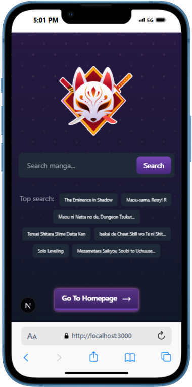&nbsp;&nbsp; 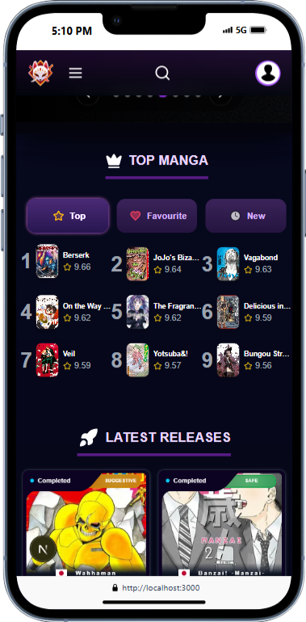&nbsp;&nbsp;  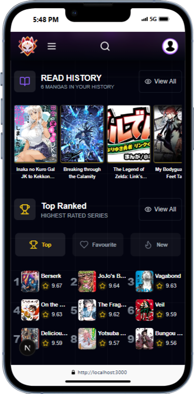&nbsp;&nbsp;  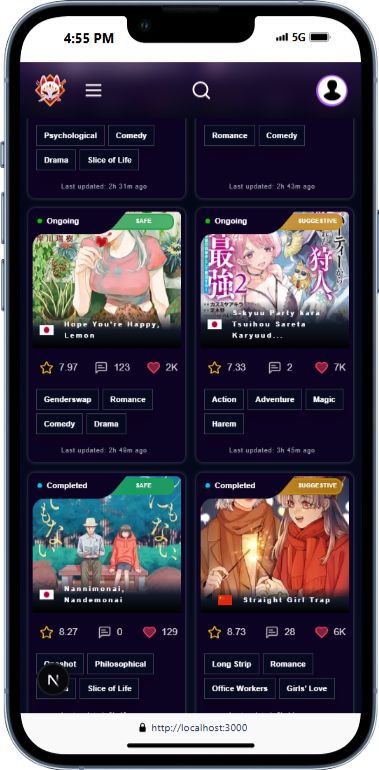&nbsp;&nbsp;  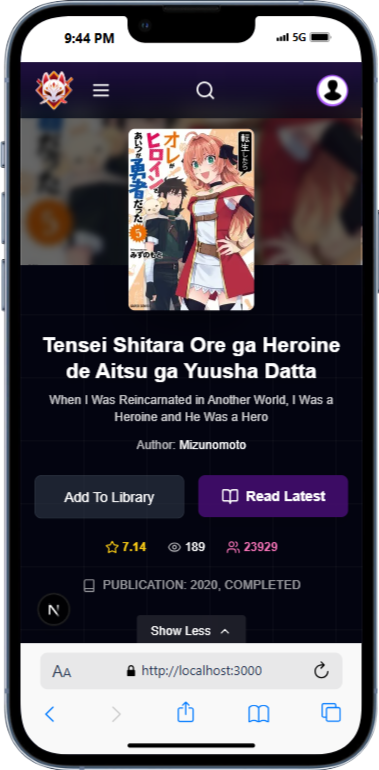&nbsp;&nbsp;  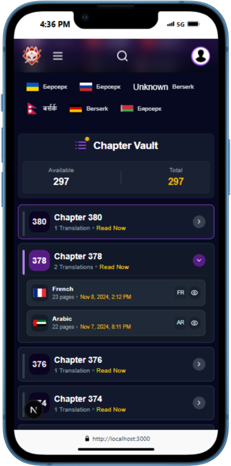&nbsp;&nbsp;&nbsp;&nbsp;  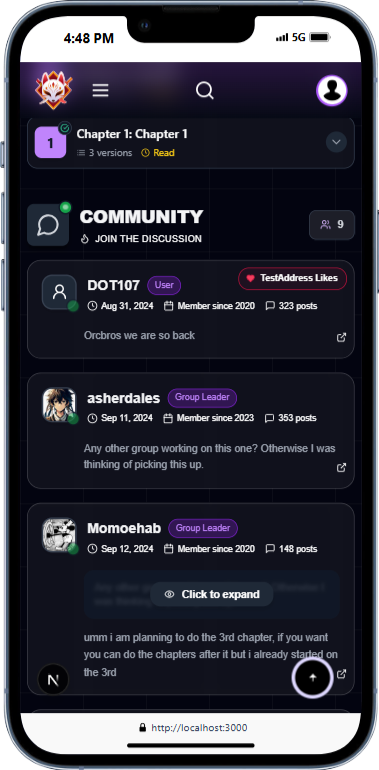&nbsp;&nbsp;  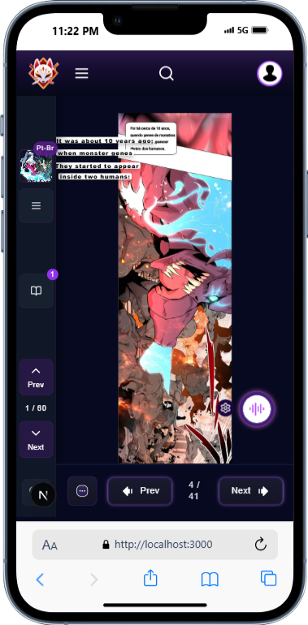&nbsp;&nbsp;  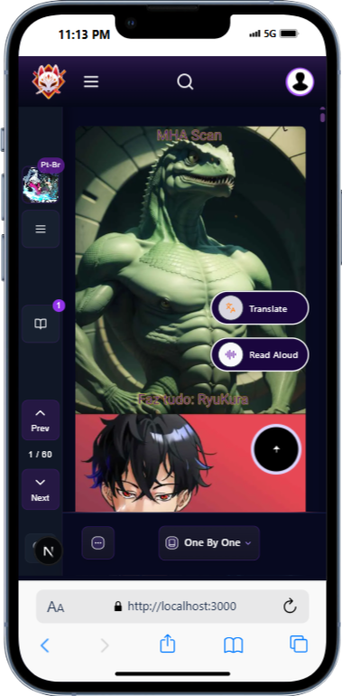&nbsp;&nbsp;  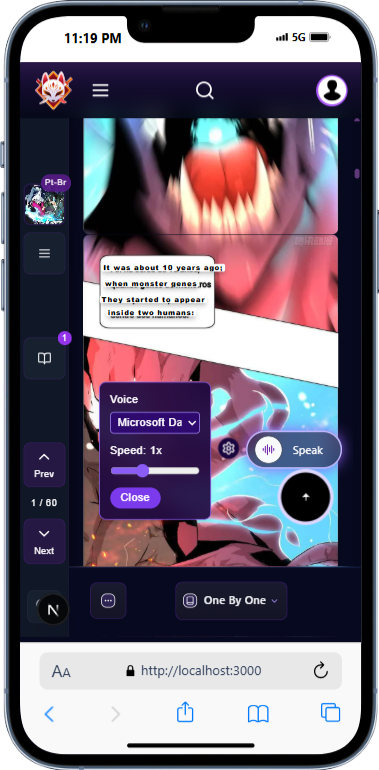  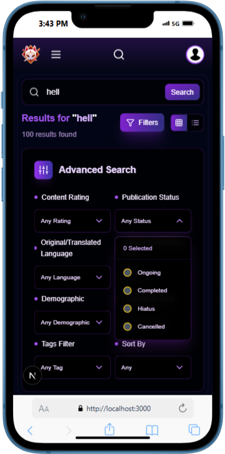&nbsp;&nbsp;  &nbsp;&nbsp;  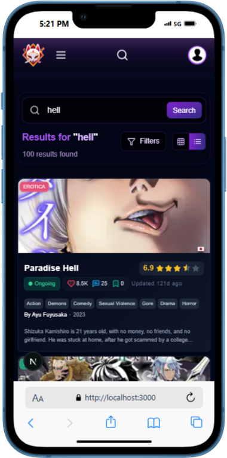

---


| 🌐 Landing Page |
| -------------- |
| 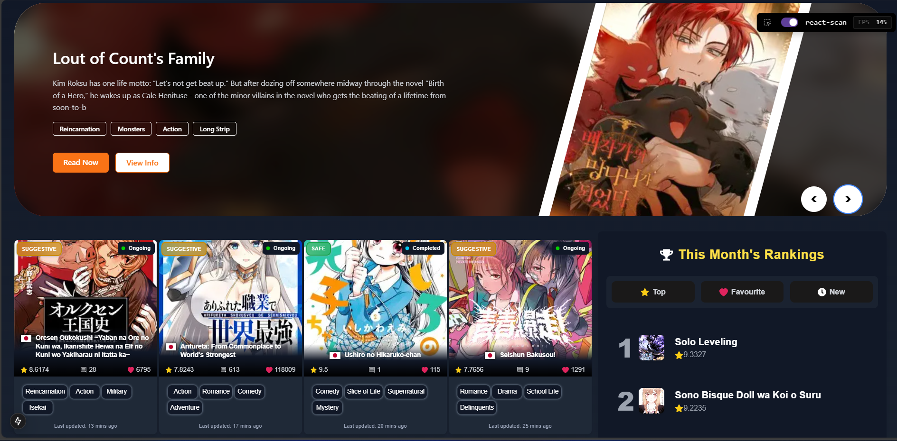 |

| 📚 Manga List | 📚 Manga List |
| ------------ | ------------ |
| 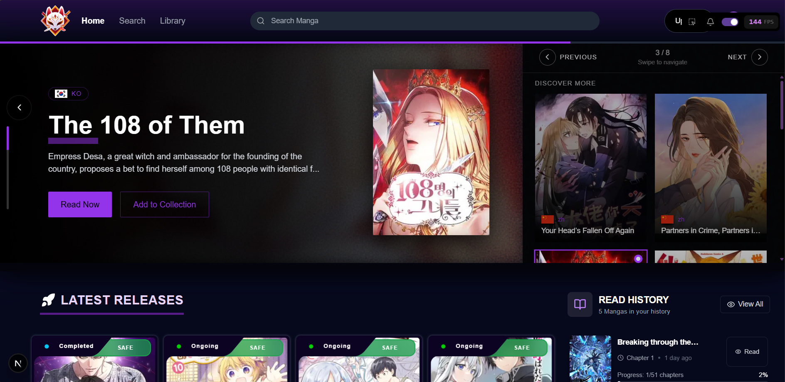 |  |

📚 Manga List | 📄 Manga Chapter | 
| --------------- | ---------------- |
| 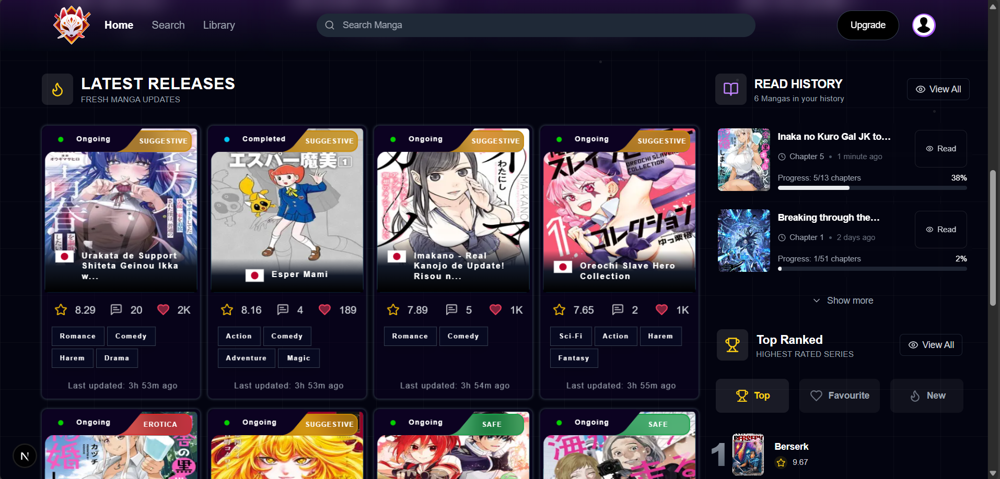 | 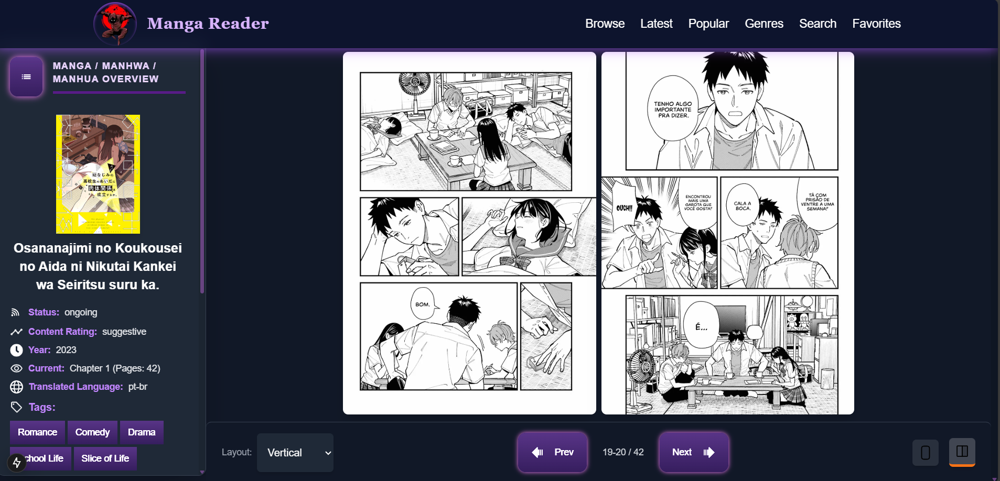 |

|📄 Manga Chapter | 📄 Manga Chapter | 
| -------------- | -------------- |
| 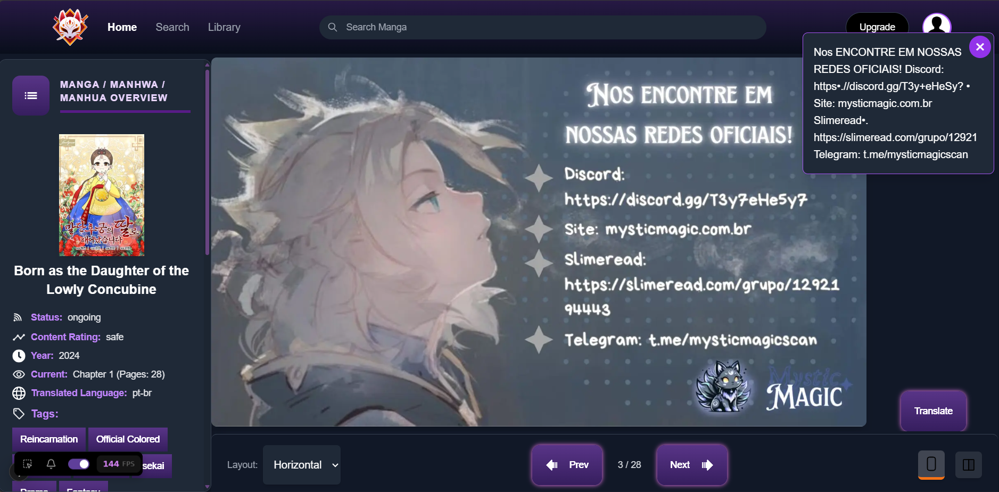 | 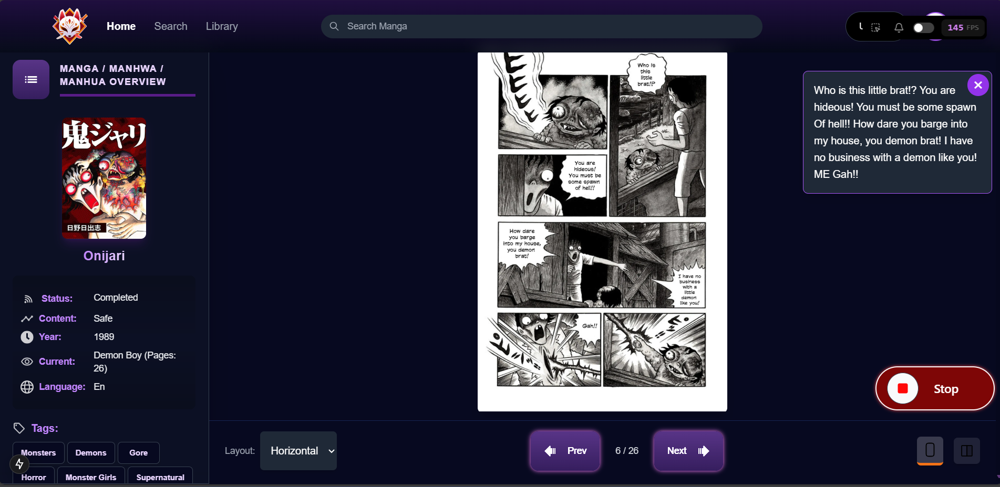 |

| 📺 Read Chapter |📺 Read Chapter |
| -------------- | -------------- |
| 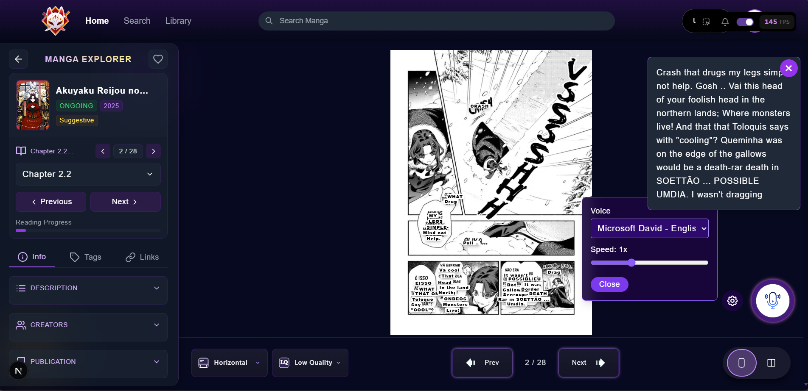 | 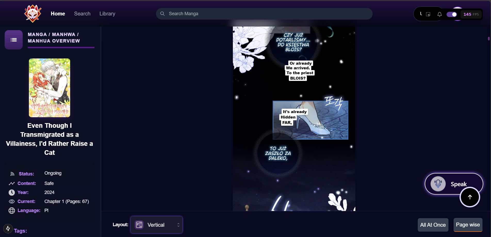 |

|  📺 Read Chapter |📺 Read Chapter| 
| ------------- | ------------- |
| 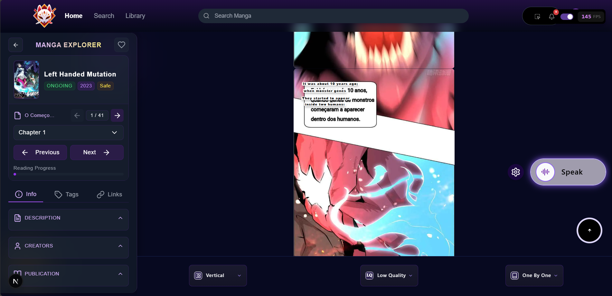 |  |

| 🔍 Search Page |🔍 Search Page |
| ------------- | ------------- |
| 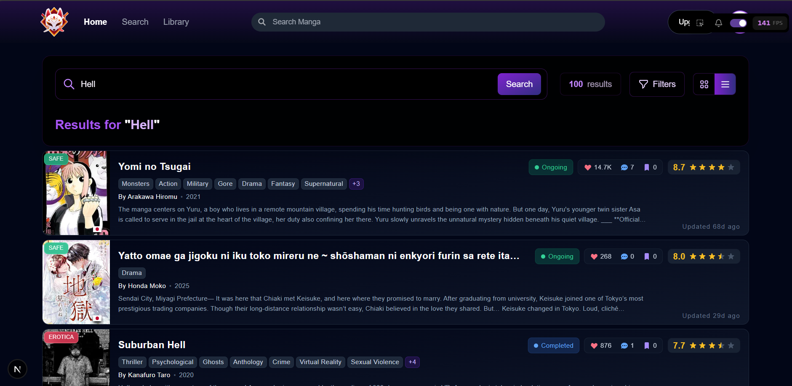 |  |

| 🔍 Search Page | 🔍 Library Page |
| ------------- | ------------- |
| 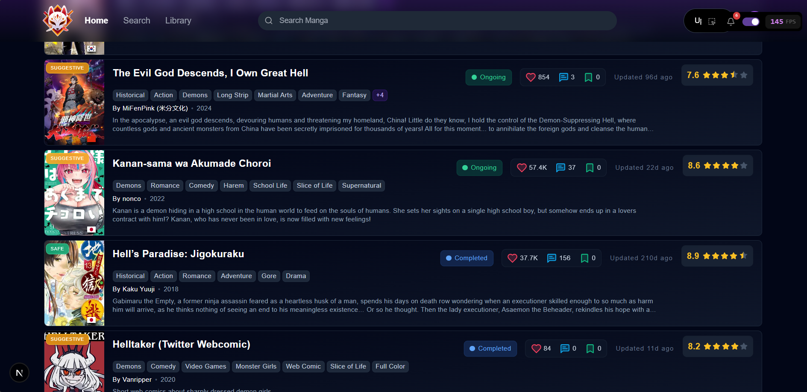 |  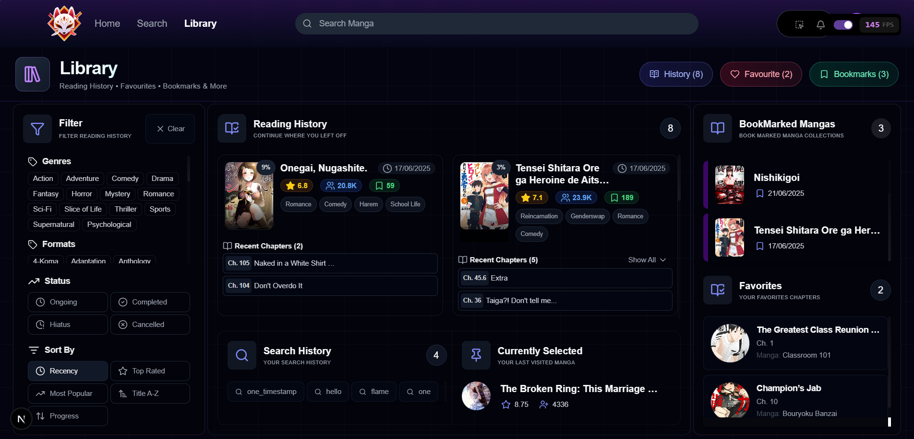 | 

---

## ✨ **Core Features**

### 📚 **Landing Page**
Your journey begins here, with a vibrant welcome to the world of manga.

- **Trending Searches**: Discover what’s hot in manga/manhwa.
- **Search Bar**: Jump straight to your next read, linking to the Search Page.
- **About Section**:
    - **Mission**: Making manga accessible to all.
    - **Copyright**: Transparent and fair usage.
    - **Goals**: Innovate and inspire manga fans.
- Tightly integrated with the TopNavBar for effortless navigation.

### 📖 **Manga List**
A dazzling hub for browsing the latest manga updates.

- **Manga Cards**: Sleek, clickable cards showcasing:
    - Latest manga with fresh chapter details.
- **Latest Activity Feed**:  
    - Displays recent community interactions from MangaDex forums.  
    - Extracted via web scraping from [MangaDex Latest Activity](https://forums.mangadex.org/whats-new/latest-activity) since no official API exists.  
    - Shows manga title, chapter, volume, chapter title, comment author, original post author, and the forum thread where the discussion is happening.  
    - Keeps you connected with real-time fan discussions and insights.
- **Sidebar**:
    - Random manga picks to spark curiosity.
- **Aside Section**:
    - Top 10 lists for:
        - **Top Manga**
        - **Favorite Manga**
        - **Latest Manga**
- **Tech Magic**:
    - **TanStack Query** for lightning-fast data fetching.
    - **Compressed Local Storage** for minimal footprint.

### 📄 **Manga Chapter**
Dive deep into your chosen manga with style and substance.

- **About Manga**: A gorgeous panel with title, author, genres, and synopsis.
- **Chapter List**:
    - Full chapter catalog with clickable links.
    - Multi-language support for global readers.
- Seamlessly transitions to the Read Chapter experience.

### 📺 **Read Chapter**
The heart of the app, where reading becomes an art form.

- **Info Sidebar**:
    - Compact manga details with tabbed navigation.
    - Buttons for:
        - Next/previous page.
        - Favorite chapter toggle.
- **Chapter Change Module**:
    - Next/previous chapter navigation.
    - Searchable dropdown with asc/desc sorting.
    - Language selector for chapters.
- **Collapsed Sidebar**:
    - Manga cover image with expand option.
    - Chapter controls and favorite button.
- **Bottom Settings**:
    - **View Modes**: Vertical or Horizontal.
    - **Quality**: High or low-resolution pages.
    - **Horizontal Mode**:
        - Toggle 1 or 2 panels.
        - Next/previous page buttons.
    - **Vertical Mode**:
        - "Top" button to zip back to the start.
    - **Coming Soon**: All-in-one or one-at-a-time page views.
- **Single Page Features**:
    - **OCR Translation**:
        - Powered by `easyocr-js` (PuddleOCR wrapper).
        - Uses Google Translate API:
          ```
          https://translate.google.com/translate_a/single?client=gtx&sl=auto&tl=${targetLang}&dt=t&q=${encodeURIComponent(text)}
          ```
        - Overlays translated text on images.
        - Top-right dialogue box for continuous OCR text flow.
    - **Text-to-Speech (TTS)**:
        - AI voices read original or translated text.
        - 20+ voice options with speed controls.
    - **Persistence**:
        - OCR, translations, dialogue, and settings saved per page.
        - Return to any page with your settings intact.

### 🔍 **Search Page**
Find your perfect manga with precision and ease.

- **Access Points**: TopNavBar or Landing Page.
- **Search Input**: Refine queries on the fly.
- **View Options**: List or Grid with pagination.
- **Filters**:
    - Content Rating
    - Publication Status
    - Original/Translated Language
    - Tags (Format, Genre, Theme, Content)
    - Publication Demographic
    - Publication Type (Manga, Manhwa, Manhua)
    - Publication Year
    - Sort By: Relevance, Rating, First Publish, Title, Creation, Follow Count, Latest Upload
- **Smart Filtering**:
    - Multi-select within categories (e.g., Manga + Manhwa).
    - Active filter count display.
    - "Clear Filters" button.
- **User-Friendly**:
    - Dialogs for empty queries, errors, or no results (with filter-clearing tips).

### 🧭 **Top Navigation Bar**
Your trusty guide across the manga universe.

- **Logo**: Returns to the Landing Page.
- **Home**: Jumps to Manga List.
- **Search**:
    - Instant search input.
    - Direct link to Search Page.
- **Future Features**: Library, Upgrade, Profile (stay tuned!).

---

## ⚡ **Performance Optimizations**
Built for speed, crafted for perfection.

- **Data Fetching**:
    - **TanStack Query**: Blazing-fast API calls.
    - **Debouncing**: No wasted requests.
- **Rendering**:
    - **Lazy Loading**: Images and components load on demand.
    - **useCallback**, **useMemo**, **React.memo**: Re-renders? Never heard of ‘em.
- **Images**:
    - **Next.js Image**: Lazy loading with placeholders.
- **Routing**:
    - **React Router**: Zips through pages faster than Next.js Router.
- **Storage**:
    - **Compressed Local Storage**: Lean and mean data persistence.
- **Error Handling**:
    - Custom **404 Page**: Lost? We’ll guide you back.

---

## 🚀 **Getting Started**

### Prerequisites
- **Node.js**: v16 or higher
- **npm** or **yarn**

> **No API Keys Needed!** The MangaDex API is open, and no `.env` file is required.

### Installation
1. Clone the repo:
    ```bash
    git clone https://github.com/VrajVyas11/AI_Manga_Reader.git
    ```
2. Navigate to the project:
    ```bash
    cd AI_Manga_Reader
    ```
3. Install dependencies:
    ```bash
    npm install
    ```
4. Start the dev server:
    ```bash
    npm run dev
    ```
5. Visit [http://localhost:3000](http://localhost:3000) in your browser.

---

## 🎯 **How to Use**

1. **Explore Manga**:
    - Start on the Landing Page or browse Manga List.
    - Check sidebars for random gems or curated lists.
    - Stay updated with the **Latest Activity Feed** showing recent forum discussions scraped directly from MangaDex forums.

2. **Read with Flair**:
    - Pick a manga, view details, and select a chapter.
    - Customize with vertical/horizontal modes, OCR translation, or TTS.

3. **Search Like a Pro**:
    - Use the Search Page or TopNavBar input.
    - Filter and sort to find your perfect read.

4. **Save Your Style**:
    - Favorite manga/chapters.
    - OCR, translation, and TTS settings persist per page.

---

## 🛣 **Roadmap**

### 🌱 **Phase 1: UX Perfection**
- [ ] Personalized manga recommendations
- [ ] Reading progress tracking
- [ ] Light/dark mode toggle
- [ ] Interactive onboarding tutorial

### 🚀 **Phase 2: Next-Level Features**
- [ ] Offline reading and downloads
- [ ] Bookmark pages/panels
- [ ] Multilingual TTS with text highlighting
- [ ] Share chapters on social media

### 🌐 **Phase 3: Community & Scale**
- [ ] Backend sync for user profiles
- [ ] Community comments and ratings
- [ ] Additional APIs (e.g., MangaPlus)

### 💰 **Phase 4: Monetization & Mobile**
- [ ] Ads and affiliate links
- [ ] Premium features (ad-free, exclusive content)
- [ ] React Native mobile app

> Suggest features or track progress on [GitHub Issues](https://github.com/VrajVyas11/AI_Manga_Reader/issues).

---

## 🤝 **Contributing**
Join the manga revolution! Here’s how to contribute:

1. Fork the repo:
    ```bash
    git clone https://github.com/VrajVyas11/AI_Manga_Reader.git
    ```
2. Create a feature branch:
    ```bash
    git checkout -b feature/your-feature
    ```
3. Commit your changes:
    ```bash
    git commit -m "Add feature: your-feature-description"
    ```
4. Push to the branch:
    ```bash
    git push origin feature/your-feature
    ```
5. Open a Pull Request.

Run `npm run lint` and add tests where possible. Check [CONTRIBUTING.md](./CONTRIBUTING.md) for details.

---

## 🙏 **Acknowledgments**
- **[MangaDex](https://mangadex.org)**: For their open API.
- **[easyocr-js](https://www.npmjs.com/package/easyocr-js)**: Our custom OCR package.
- **[Google Translate API](https://cloud.google.com/translate)**: For seamless translations.
- **[Next.js](https://nextjs.org)**: The backbone of our app.
- **Manga Fans**: You inspire us every day.
- **MangaDex Forums**: For the vibrant community discussions that enrich the manga experience.

---

## 📜 **License**
© 2025 AI Manga Reader. Licensed under the [MIT License](LICENSE).

---

🌟 **Thank You for Joining the AI Manga Reader Adventure!**  
Star us on [GitHub](https://github.com/VrajVyas11/AI_Manga_Reader) or share ideas via [issues](https://github.com/VrajVyas11/AI_Manga_Reader/issues). Together, let’s craft the ultimate manga experience! 🚀
